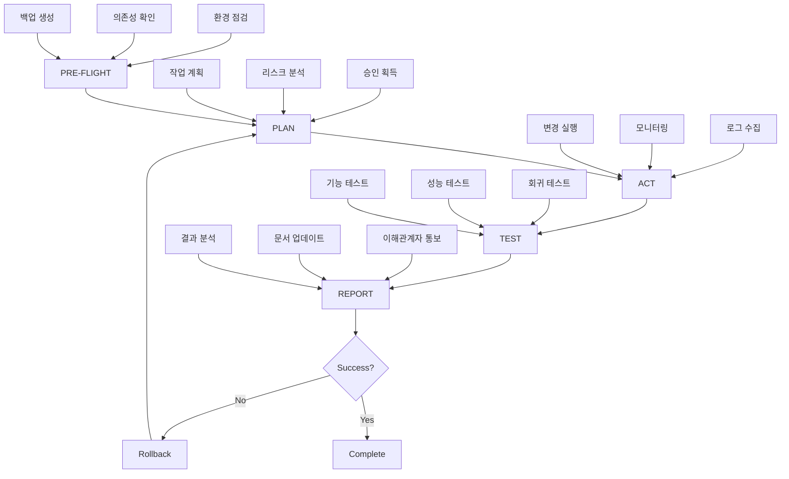

# 09_Runbook.md

## 운영 절차서 (Operations Runbook)

### 운영 절차 개요 (Operations Procedure Overview)

KIS_CORE_V3 운영 절차는 5단계 방법론을 따릅니다: **PRE-FLIGHT → PLAN → ACT → TEST → REPORT**. 이 체계적 접근법을 통해 안정적이고 예측 가능한 시스템 운영을 보장합니다.

### 절차 흐름도 (Procedure Flow)



## PHASE 1: PRE-FLIGHT (사전 점검)

### 1.1 환경 점검 (Environment Check)

#### 시스템 상태 확인 (System Health Check)
```bash
#!/bin/bash
# preflight-system-check.sh

echo "=== KIS_CORE_V3 PRE-FLIGHT CHECK ==="
echo "Timestamp: $(date -u)"
echo "Operator: $(whoami)"
echo "Environment: ${ENVIRONMENT:-production}"
echo

# 1. 서비스 상태 확인
echo "1. Service Status Check"
echo "------------------------"
services=("api-gateway" "estimator-service" "erp-ai-service" "postgresql" "redis")
for service in "${services[@]}"; do
    if systemctl is-active --quiet $service; then
        echo "✅ $service: RUNNING"
    else
        echo "❌ $service: STOPPED"
        exit 1
    fi
done

# 2. 리소스 사용량 확인
echo -e "\n2. Resource Usage Check"
echo "------------------------"
cpu_usage=$(top -bn1 | grep "Cpu(s)" | awk '{print $2}' | cut -d'%' -f1)
memory_usage=$(free | grep Mem | awk '{printf "%.1f", $3/$2 * 100.0}')
disk_usage=$(df -h / | awk 'NR==2 {print $5}' | cut -d'%' -f1)

echo "CPU Usage: ${cpu_usage}%"
echo "Memory Usage: ${memory_usage}%"
echo "Disk Usage: ${disk_usage}%"

# 임계치 확인
if (( $(echo "$cpu_usage > 80" | bc -l) )); then
    echo "⚠️  WARNING: High CPU usage"
fi
if (( $(echo "$memory_usage > 85" | bc -l) )); then
    echo "⚠️  WARNING: High memory usage"
fi
if [ "$disk_usage" -gt 90 ]; then
    echo "⚠️  WARNING: High disk usage"
fi

# 3. 네트워크 연결 확인
echo -e "\n3. Network Connectivity Check"
echo "-------------------------------"
endpoints=("https://api.kis-core.com/health" "postgresql://localhost:5432" "redis://localhost:6379")
for endpoint in "${endpoints[@]}"; do
    if curl -s --connect-timeout 5 "$endpoint" > /dev/null 2>&1; then
        echo "✅ $endpoint: REACHABLE"
    else
        echo "❌ $endpoint: UNREACHABLE"
    fi
done

echo -e "\n=== PRE-FLIGHT CHECK COMPLETE ==="
```

#### 의존성 확인 (Dependencies Check)
```bash
#!/bin/bash
# preflight-dependencies.sh

echo "=== DEPENDENCIES CHECK ==="

# 1. 데이터베이스 연결 확인
echo "1. Database Connection"
echo "----------------------"
psql -h localhost -U kis_user -d kis_db -c "SELECT version();" > /dev/null 2>&1
if [ $? -eq 0 ]; then
    echo "✅ PostgreSQL: CONNECTED"
else
    echo "❌ PostgreSQL: CONNECTION FAILED"
    exit 1
fi

# 2. 캐시 서버 확인
echo -e "\n2. Cache Server"
echo "---------------"
redis-cli ping > /dev/null 2>&1
if [ $? -eq 0 ]; then
    echo "✅ Redis: CONNECTED"
else
    echo "❌ Redis: CONNECTION FAILED"
    exit 1
fi

# 3. 외부 API 확인
echo -e "\n3. External APIs"
echo "----------------"
external_apis=("https://api.openai.com/v1/models" "https://api.textIn.com/health")
for api in "${external_apis[@]}"; do
    response=$(curl -s -w "%{http_code}" -o /dev/null "$api")
    if [ "$response" -eq 200 ]; then
        echo "✅ $api: AVAILABLE"
    else
        echo "⚠️ $api: HTTP $response"
    fi
done

# 4. 환경 변수 확인
echo -e "\n4. Environment Variables"
echo "------------------------"
required_vars=("DATABASE_URL" "REDIS_URL" "JWT_SECRET" "OPENAI_API_KEY")
for var in "${required_vars[@]}"; do
    if [ -n "${!var}" ]; then
        echo "✅ $var: SET"
    else
        echo "❌ $var: NOT SET"
        exit 1
    fi
done

echo -e "\n=== DEPENDENCIES CHECK COMPLETE ==="
```

### 1.2 백업 생성 (Backup Creation)

#### 자동 백업 스크립트 (Automated Backup Script)
```bash
#!/bin/bash
# preflight-backup.sh

BACKUP_DIR="/backups/$(date +%Y%m%d_%H%M%S)"
mkdir -p "$BACKUP_DIR"

echo "=== BACKUP CREATION ==="
echo "Backup Directory: $BACKUP_DIR"

# 1. 데이터베이스 백업
echo "1. Database Backup"
echo "------------------"
pg_dump -h localhost -U kis_user kis_db | gzip > "$BACKUP_DIR/database.sql.gz"
if [ $? -eq 0 ]; then
    echo "✅ Database backup: SUCCESS"
else
    echo "❌ Database backup: FAILED"
    exit 1
fi

# 2. 설정 파일 백업
echo -e "\n2. Configuration Backup"
echo "-----------------------"
config_files=("/etc/nginx/nginx.conf" "/app/config/production.json" "/app/.env")
for file in "${config_files[@]}"; do
    if [ -f "$file" ]; then
        cp "$file" "$BACKUP_DIR/"
        echo "✅ $file: BACKED UP"
    else
        echo "⚠️ $file: FILE NOT FOUND"
    fi
done

# 3. 애플리케이션 상태 스냅샷
echo -e "\n3. Application State"
echo "-------------------"
docker ps --format "table {{.Names}}\t{{.Status}}\t{{.Ports}}" > "$BACKUP_DIR/docker_state.txt"
systemctl list-units --type=service --state=running > "$BACKUP_DIR/service_state.txt"

# 4. 백업 검증
echo -e "\n4. Backup Verification"
echo "----------------------"
backup_size=$(du -sh "$BACKUP_DIR" | cut -f1)
echo "Backup Size: $backup_size"
echo "Backup Location: $BACKUP_DIR"

# 백업 메타데이터 생성
cat > "$BACKUP_DIR/backup_metadata.json" << EOF
{
  "timestamp": "$(date -u +%Y-%m-%dT%H:%M:%SZ)",
  "operator": "$(whoami)",
  "environment": "${ENVIRONMENT:-production}",
  "backup_type": "pre-flight",
  "files": [
    "database.sql.gz",
    "nginx.conf",
    "production.json",
    ".env",
    "docker_state.txt",
    "service_state.txt"
  ]
}
EOF

echo "✅ Backup metadata created"
echo -e "\n=== BACKUP CREATION COMPLETE ==="
```

## PHASE 2: PLAN (계획 수립)

### 2.1 작업 계획 수립 (Work Planning)

#### 변경 계획 템플릿 (Change Plan Template)
```yaml
# change_plan_template.yml
change_request:
  id: "CR-2025-001"
  title: "견적 AI 모델 업데이트"
  type: "enhancement"  # maintenance, bugfix, enhancement, emergency
  priority: "medium"   # low, medium, high, critical
  
requester:
  name: "이충원"
  role: "대표이사"
  contact: "ceo@company.com"
  
description:
  summary: "견적 AI 모델을 v2.3.1에서 v2.4.0으로 업데이트"
  business_justification: "정확도 3% 향상, 처리 속도 15% 개선"
  technical_details: |
    - 새로운 훈련 데이터셋 적용
    - 알고리즘 최적화
    - API 호환성 유지
    
scope:
  systems_affected:
    - "ERP-AI Service"
    - "API Gateway"
    - "견적 생성 기능"
  
  components_modified:
    - "/app/services/ai-model"
    - "/app/config/model-config.json"
    - "/docker/ai-service/Dockerfile"
    
  data_changes:
    - "AI 모델 바이너리 파일 교체"
    - "설정 값 업데이트"
    
timeline:
  planned_start: "2025-09-23T02:00:00Z"
  estimated_duration: "2 hours"
  planned_completion: "2025-09-23T04:00:00Z"
  
  milestones:
    - "02:00 - 작업 시작, 트래픽 차단"
    - "02:15 - 새 모델 배포"
    - "02:45 - 테스트 실행"
    - "03:30 - 트래픽 복구"
    - "04:00 - 작업 완료"
    
risks_and_mitigations:
  - risk: "AI 모델 호환성 문제"
    probability: "low"
    impact: "high"
    mitigation: "이전 모델로 즉시 롤백"
    
  - risk: "성능 저하"
    probability: "medium"
    impact: "medium"
    mitigation: "실시간 모니터링 및 자동 알람"
    
rollback_plan:
  trigger_conditions:
    - "API 응답 시간 > 5초"
    - "에러율 > 1%"
    - "AI 예측 정확도 < 90%"
    
  rollback_steps:
    1. "트래픽 차단"
    2. "이전 모델 파일 복원"
    3. "서비스 재시작"
    4. "테스트 실행"
    5. "트래픽 복구"
    
  estimated_rollback_time: "30 minutes"
  
approval:
  technical_approval:
    approver: "Lead Architect"
    status: "pending"
    timestamp: null
    
  business_approval:
    approver: "이충원 (대표이사)"
    status: "approved"
    timestamp: "2025-09-22T10:30:00Z"
    
  security_approval:
    approver: "Security Officer"
    status: "approved"
    timestamp: "2025-09-22T11:00:00Z"
```

### 2.2 리스크 분석 (Risk Analysis)

#### 리스크 평가 매트릭스 (Risk Assessment Matrix)
```javascript
// risk-assessment.js
const riskMatrix = {
  probability: {
    very_low: 1,    // < 5%
    low: 2,         // 5-15%
    medium: 3,      // 15-40%
    high: 4,        // 40-70%
    very_high: 5    // > 70%
  },
  
  impact: {
    negligible: 1,  // 무시할 수 있는 영향
    minor: 2,       // 약간의 불편
    moderate: 3,    // 기능 제한
    major: 4,       // 서비스 중단
    severe: 5       // 심각한 손실
  }
};

function calculateRiskScore(probability, impact) {
  const probScore = riskMatrix.probability[probability];
  const impactScore = riskMatrix.impact[impact];
  return probScore * impactScore;
}

function getRiskLevel(score) {
  if (score <= 4) return 'LOW';
  if (score <= 9) return 'MEDIUM';
  if (score <= 16) return 'HIGH';
  return 'CRITICAL';
}

// 리스크 평가 예시
const risks = [
  {
    id: 'R001',
    description: 'AI 모델 호환성 문제',
    probability: 'low',
    impact: 'major',
    mitigation: '이전 모델로 즉시 롤백',
    owner: 'AI Team Lead'
  },
  {
    id: 'R002',
    description: '데이터베이스 연결 실패',
    probability: 'very_low',
    impact: 'severe',
    mitigation: '데이터베이스 클러스터 및 연결 풀 설정',
    owner: 'DevOps Engineer'
  }
];

// 리스크 보고서 생성
function generateRiskReport(risks) {
  return risks.map(risk => {
    const score = calculateRiskScore(risk.probability, risk.impact);
    const level = getRiskLevel(score);
    
    return {
      ...risk,
      score,
      level,
      requires_executive_approval: level === 'CRITICAL' || level === 'HIGH'
    };
  });
}
```

## PHASE 3: ACT (실행)

### 3.1 변경 실행 (Change Execution)

#### 배포 자동화 스크립트 (Deployment Automation Script)
```bash
#!/bin/bash
# deployment-script.sh

set -e  # 에러 발생 시 즉시 중단

DEPLOYMENT_ID="DEPLOY-$(date +%Y%m%d-%H%M%S)"
LOG_FILE="/var/log/deployments/${DEPLOYMENT_ID}.log"
SLACK_WEBHOOK="https://hooks.slack.com/services/YOUR/SLACK/WEBHOOK"

# 로깅 함수
log() {
    echo "[$(date '+%Y-%m-%d %H:%M:%S')] $1" | tee -a "$LOG_FILE"
}

# Slack 알림 함수
slack_notify() {
    local message="$1"
    local color="${2:-good}"
    
    curl -X POST -H 'Content-type: application/json' \
        --data "{\"attachments\":[{\"color\":\"$color\",\"text\":\"$message\"}]}" \
        "$SLACK_WEBHOOK"
}

log "=== DEPLOYMENT START: $DEPLOYMENT_ID ==="
slack_notify "🚀 Deployment started: $DEPLOYMENT_ID"

# 1. 트래픽 차단
log "1. Blocking traffic..."
nginx -s reload -c /etc/nginx/maintenance.conf
sleep 10

# 2. 서비스 중지
log "2. Stopping services..."
systemctl stop estimator-service
systemctl stop erp-ai-service

# 3. 백업 생성
log "3. Creating deployment backup..."
./scripts/preflight-backup.sh

# 4. 새 버전 배포
log "4. Deploying new version..."
docker pull kis-core/estimator:latest
docker pull kis-core/erp-ai:latest

# 5. 데이터베이스 마이그레이션 (필요시)
log "5. Running database migrations..."
if [ -f "migrations/pending.sql" ]; then
    psql -h localhost -U kis_user -d kis_db -f migrations/pending.sql
    log "Database migrations completed"
else
    log "No pending migrations"
fi

# 6. 서비스 시작
log "6. Starting services..."
systemctl start estimator-service
systemctl start erp-ai-service

# 7. 헬스 체크
log "7. Health check..."
sleep 30

health_check() {
    local service_url="$1"
    local max_attempts=10
    local attempt=1
    
    while [ $attempt -le $max_attempts ]; do
        if curl -f -s "$service_url/health" > /dev/null; then
            log "✅ $service_url: HEALTHY"
            return 0
        fi
        log "⏳ $service_url: Attempt $attempt/$max_attempts"
        sleep 10
        ((attempt++))
    done
    
    log "❌ $service_url: UNHEALTHY after $max_attempts attempts"
    return 1
}

# 서비스 헬스 체크
if health_check "http://localhost:3001" && health_check "http://localhost:8000"; then
    # 8. 트래픽 복구
    log "8. Restoring traffic..."
    nginx -s reload -c /etc/nginx/production.conf
    
    log "=== DEPLOYMENT SUCCESS: $DEPLOYMENT_ID ==="
    slack_notify "✅ Deployment successful: $DEPLOYMENT_ID"
else
    log "=== DEPLOYMENT FAILED: $DEPLOYMENT_ID ==="
    log "Initiating rollback..."
    
    ./scripts/rollback.sh
    slack_notify "❌ Deployment failed: $DEPLOYMENT_ID. Rollback initiated." "danger"
    exit 1
fi
```

### 3.2 실시간 모니터링 (Real-time Monitoring)

#### 배포 모니터링 대시보드 (Deployment Monitoring Dashboard)
```javascript
// monitoring-dashboard.js
const monitoringMetrics = {
  // 주요 지표 정의
  criticalMetrics: [
    'api_response_time_p95',
    'error_rate',
    'active_connections',
    'cpu_utilization',
    'memory_usage'
  ],
  
  // 임계치 설정
  thresholds: {
    api_response_time_p95: 2100,
    error_rate: 0.01,
    active_connections: 1000,
    cpu_utilization: 80,
    memory_usage: 85
  },
  
  // 모니터링 간격
  intervals: {
    critical: 30,    // 30초
    normal: 300,     // 5분
    extended: 3600   // 1시간
  }
};

class DeploymentMonitor {
  constructor(deploymentId) {
    this.deploymentId = deploymentId;
    this.alerts = [];
    this.metrics = {};
    this.isMonitoring = false;
  }
  
  async startMonitoring() {
    this.isMonitoring = true;
    console.log(`🔍 Starting deployment monitoring for ${this.deploymentId}`);
    
    // 크리티컬 메트릭 모니터링 (30초 간격)
    this.criticalInterval = setInterval(async () => {
      await this.collectCriticalMetrics();
      await this.checkThresholds();
    }, monitoringMetrics.intervals.critical * 1000);
    
    // 확장 메트릭 모니터링 (5분 간격)
    this.extendedInterval = setInterval(async () => {
      await this.collectExtendedMetrics();
      await this.generateReport();
    }, monitoringMetrics.intervals.normal * 1000);
  }
  
  async collectCriticalMetrics() {
    try {
      // API 응답 시간
      const apiMetrics = await this.getApiMetrics();
      this.metrics.api_response_time_p95 = apiMetrics.p95;
      this.metrics.error_rate = apiMetrics.errorRate;
      
      // 시스템 리소스
      const systemMetrics = await this.getSystemMetrics();
      this.metrics.cpu_utilization = systemMetrics.cpu;
      this.metrics.memory_usage = systemMetrics.memory;
      
      // 연결 수
      const connectionMetrics = await this.getConnectionMetrics();
      this.metrics.active_connections = connectionMetrics.active;
      
    } catch (error) {
      console.error('Failed to collect metrics:', error);
      this.addAlert('CRITICAL', 'Metric collection failed', error.message);
    }
  }
  
  async checkThresholds() {
    const violations = [];
    
    for (const [metric, value] of Object.entries(this.metrics)) {
      const threshold = monitoringMetrics.thresholds[metric];
      if (threshold && value > threshold) {
        violations.push({
          metric,
          value,
          threshold,
          severity: this.getSeverity(metric, value, threshold)
        });
      }
    }
    
    if (violations.length > 0) {
      await this.handleThresholdViolations(violations);
    }
  }
  
  async handleThresholdViolations(violations) {
    const criticalViolations = violations.filter(v => v.severity === 'CRITICAL');
    
    if (criticalViolations.length > 0) {
      console.error('🚨 CRITICAL THRESHOLD VIOLATIONS:', criticalViolations);
      
      // 자동 롤백 트리거
      if (this.shouldAutoRollback(criticalViolations)) {
        console.log('🔄 Triggering automatic rollback...');
        await this.triggerRollback();
      }
      
      // 즉시 알림
      await this.sendCriticalAlert(criticalViolations);
    }
  }
  
  shouldAutoRollback(violations) {
    // 자동 롤백 조건
    const autoRollbackTriggers = [
      'api_response_time_p95',
      'error_rate'
    ];
    
    return violations.some(v => 
      autoRollbackTriggers.includes(v.metric) && 
      v.value > v.threshold * 1.5  // 임계치의 150% 초과
    );
  }
  
  async generateReport() {
    const report = {
      deploymentId: this.deploymentId,
      timestamp: new Date().toISOString(),
      metrics: this.metrics,
      alerts: this.alerts,
      status: this.getOverallStatus()
    };
    
    console.log('📊 Deployment monitoring report:', report);
    return report;
  }
  
  stopMonitoring() {
    this.isMonitoring = false;
    if (this.criticalInterval) clearInterval(this.criticalInterval);
    if (this.extendedInterval) clearInterval(this.extendedInterval);
    console.log('⏹️ Monitoring stopped');
  }
}

// 사용 예시
const monitor = new DeploymentMonitor('DEPLOY-20250922-143000');
await monitor.startMonitoring();

// 배포 완료 후 모니터링 중단
setTimeout(() => {
  monitor.stopMonitoring();
}, 30 * 60 * 1000); // 30분 후
```

## PHASE 4: TEST (테스트)

### 4.1 배포 후 테스트 (Post-deployment Testing)

#### 자동화된 스모크 테스트 (Automated Smoke Tests)
```javascript
// smoke-tests.js
const SmokeTests = {
  async runAllTests() {
    const results = {
      passed: 0,
      failed: 0,
      tests: []
    };
    
    const testSuites = [
      this.testCriticalPaths,
      this.testApiEndpoints,
      this.testDatabaseConnections,
      this.testExternalIntegrations,
      this.testPerformanceBaseline
    ];
    
    for (const testSuite of testSuites) {
      try {
        const suiteResults = await testSuite.call(this);
        results.tests.push(...suiteResults);
        results.passed += suiteResults.filter(t => t.status === 'PASS').length;
        results.failed += suiteResults.filter(t => t.status === 'FAIL').length;
      } catch (error) {
        console.error('Test suite failed:', error);
        results.failed++;
      }
    }
    
    return results;
  },
  
  async testCriticalPaths() {
    console.log('🧪 Testing critical paths...');
    const tests = [];
    
    // 1. 사용자 인증 테스트
    tests.push(await this.testUserAuthentication());
    
    // 2. 견적 생성 테스트
    tests.push(await this.testEstimateCreation());
    
    // 3. AI 예측 테스트
    tests.push(await this.testAIPrediction());
    
    return tests;
  },
  
  async testUserAuthentication() {
    try {
      const response = await fetch('/api/v1/auth/login', {
        method: 'POST',
        headers: { 'Content-Type': 'application/json' },
        body: JSON.stringify({
          email: 'test@company.com',
          password: 'test123'
        })
      });
      
      if (response.ok) {
        const data = await response.json();
        return {
          name: 'User Authentication',
          status: 'PASS',
          duration: Date.now() - startTime,
          details: 'Login successful, token received'
        };
      } else {
        throw new Error(`HTTP ${response.status}`);
      }
    } catch (error) {
      return {
        name: 'User Authentication',
        status: 'FAIL',
        duration: Date.now() - startTime,
        error: error.message
      };
    }
  },
  
  async testEstimateCreation() {
    const startTime = Date.now();
    try {
      const response = await fetch('/api/v1/estimate', {
        method: 'POST',
        headers: {
          'Content-Type': 'application/json',
          'Authorization': 'Bearer ' + await this.getTestToken()
        },
        body: JSON.stringify({
          customerId: 'test_customer',
          projectName: 'Smoke Test Project',
          estimateItems: [{
            category: 'HARDWARE',
            itemCode: 'TEST_001',
            quantity: 1
          }]
        })
      });
      
      if (response.ok) {
        const data = await response.json();
        return {
          name: 'Estimate Creation',
          status: 'PASS',
          duration: Date.now() - startTime,
          details: `Estimate ${data.estimateId} created successfully`
        };
      } else {
        throw new Error(`HTTP ${response.status}`);
      }
    } catch (error) {
      return {
        name: 'Estimate Creation',
        status: 'FAIL',
        duration: Date.now() - startTime,
        error: error.message
      };
    }
  },
  
  async testApiEndpoints() {
    console.log('🌐 Testing API endpoints...');
    const endpoints = [
      { path: '/api/v1/health', method: 'GET', expected: 200 },
      { path: '/api/v1/estimates', method: 'GET', expected: 200 },
      { path: '/api/v1/templates', method: 'GET', expected: 200 }
    ];
    
    const tests = [];
    for (const endpoint of endpoints) {
      tests.push(await this.testEndpoint(endpoint));
    }
    
    return tests;
  },
  
  async testPerformanceBaseline() {
    console.log('⚡ Testing performance baseline...');
    const tests = [];
    
    // API 응답 시간 테스트
    const startTime = Date.now();
    try {
      const response = await fetch('/api/v1/health');
      const duration = Date.now() - startTime;
      
      tests.push({
        name: 'API Response Time',
        status: duration <= 2100 ? 'PASS' : 'FAIL',
        duration: duration,
        details: `Response time: ${duration}ms (threshold: 2100ms)`
      });
    } catch (error) {
      tests.push({
        name: 'API Response Time',
        status: 'FAIL',
        error: error.message
      });
    }
    
    return tests;
  }
};

// 스모크 테스트 실행
async function runSmokeTests() {
  console.log('🚀 Starting smoke tests...');
  const results = await SmokeTests.runAllTests();
  
  console.log('📊 Smoke test results:');
  console.log(`  Passed: ${results.passed}`);
  console.log(`  Failed: ${results.failed}`);
  console.log(`  Total: ${results.tests.length}`);
  
  if (results.failed > 0) {
    console.error('❌ Smoke tests failed!');
    process.exit(1);
  } else {
    console.log('✅ All smoke tests passed!');
  }
  
  return results;
}
```

### 4.2 성능 회귀 테스트 (Performance Regression Testing)

#### 성능 벤치마크 테스트 (Performance Benchmark Test)
```bash
#!/bin/bash
# performance-regression-test.sh

echo "=== PERFORMANCE REGRESSION TEST ==="
echo "Timestamp: $(date -u)"

# 테스트 설정
TARGET_URL="https://api.kis-core.com"
CONCURRENT_USERS=50
TEST_DURATION=300  # 5분
ACCEPTABLE_P95=2100  # ms

# 1. 부하 테스트 실행
echo "1. Running load test..."
echo "Target: $TARGET_URL"
echo "Concurrent Users: $CONCURRENT_USERS"
echo "Duration: ${TEST_DURATION}s"

# k6를 이용한 부하 테스트
k6 run --vus $CONCURRENT_USERS --duration ${TEST_DURATION}s - <<EOF
import http from 'k6/http';
import { check, sleep } from 'k6';

export default function() {
  // 헬스 체크
  let response = http.get('${TARGET_URL}/api/v1/health');
  check(response, {
    'status is 200': (r) => r.status === 200,
    'response time < 2100ms': (r) => r.timings.duration < 2100,
  });
  
  // 견적 목록 조회
  response = http.get('${TARGET_URL}/api/v1/estimates', {
    headers: { 'Authorization': 'Bearer test-token' }
  });
  check(response, {
    'estimates status is 200': (r) => r.status === 200,
  });
  
  sleep(1);
}

export function handleSummary(data) {
  return {
    '/tmp/k6-results.json': JSON.stringify(data),
  };
}
EOF

# 2. 결과 분석
echo -e "\n2. Analyzing results..."
RESULTS_FILE="/tmp/k6-results.json"

if [ -f "$RESULTS_FILE" ]; then
    # JSON 결과 파싱
    p95_response_time=$(jq -r '.metrics.http_req_duration.values.p95' "$RESULTS_FILE")
    avg_response_time=$(jq -r '.metrics.http_req_duration.values.avg' "$RESULTS_FILE")
    error_rate=$(jq -r '.metrics.http_req_failed.values.rate' "$RESULTS_FILE")
    
    echo "Results:"
    echo "  Average Response Time: ${avg_response_time}ms"
    echo "  P95 Response Time: ${p95_response_time}ms"
    echo "  Error Rate: ${error_rate}%"
    
    # 성능 기준 확인
    if (( $(echo "$p95_response_time > $ACCEPTABLE_P95" | bc -l) )); then
        echo "❌ PERFORMANCE REGRESSION: P95 response time exceeds threshold"
        echo "   Current: ${p95_response_time}ms"
        echo "   Threshold: ${ACCEPTABLE_P95}ms"
        exit 1
    else
        echo "✅ PERFORMANCE TEST PASSED"
    fi
    
    # 에러율 확인
    if (( $(echo "$error_rate > 0.01" | bc -l) )); then
        echo "❌ ERROR RATE TOO HIGH: ${error_rate}%"
        exit 1
    fi
    
else
    echo "❌ Performance test results not found"
    exit 1
fi

echo -e "\n=== PERFORMANCE REGRESSION TEST COMPLETE ==="
```

## PHASE 5: REPORT (보고)

### 5.1 결과 분석 및 보고 (Result Analysis & Reporting)

#### 자동 배포 보고서 생성 (Automated Deployment Report Generation)
```javascript
// deployment-report-generator.js
class DeploymentReportGenerator {
  constructor(deploymentId) {
    this.deploymentId = deploymentId;
    this.startTime = new Date();
    this.endTime = null;
    this.status = 'IN_PROGRESS';
    this.metrics = {};
    this.tests = [];
    this.issues = [];
  }
  
  async generateReport() {
    this.endTime = new Date();
    const duration = this.endTime - this.startTime;
    
    const report = {
      deployment: {
        id: this.deploymentId,
        startTime: this.startTime.toISOString(),
        endTime: this.endTime.toISOString(),
        duration: this.formatDuration(duration),
        status: this.status,
        operator: process.env.USER || 'system'
      },
      
      summary: {
        overall_status: this.getOverallStatus(),
        critical_issues: this.issues.filter(i => i.severity === 'CRITICAL').length,
        performance_status: this.getPerformanceStatus(),
        test_results: this.getTestSummary()
      },
      
      metrics: {
        pre_deployment: await this.getPreDeploymentMetrics(),
        post_deployment: await this.getPostDeploymentMetrics(),
        comparison: this.compareMetrics()
      },
      
      tests: {
        smoke_tests: this.tests.filter(t => t.type === 'smoke'),
        regression_tests: this.tests.filter(t => t.type === 'regression'),
        performance_tests: this.tests.filter(t => t.type === 'performance')
      },
      
      issues: this.issues,
      
      rollback: {
        executed: this.status === 'ROLLED_BACK',
        reason: this.rollbackReason || null,
        duration: this.rollbackDuration || null
      },
      
      recommendations: this.generateRecommendations()
    };
    
    return report;
  }
  
  generate12LineQCSummary() {
    const timestamp = new Date().toISOString();
    const duration = this.endTime ? this.formatDuration(this.endTime - this.startTime) : 'In Progress';
    const smokeTestsPassed = this.tests.filter(t => t.type === 'smoke' && t.status === 'PASS').length;
    const totalSmokeTests = this.tests.filter(t => t.type === 'smoke').length;
    const criticalIssues = this.issues.filter(i => i.severity === 'CRITICAL').length;
    
    return `
KIS_CORE_V3 Deployment Report - ${timestamp}
============================================
Deployment ID: ${this.deploymentId}
Status: ${this.status} (Duration: ${duration})
Smoke Tests: ${smokeTestsPassed}/${totalSmokeTests} passed
Performance: ${this.getPerformanceStatus()}
Critical Issues: ${criticalIssues}
API Health: ${this.metrics.api_health || 'Unknown'}
Database: ${this.metrics.db_health || 'Unknown'}
Cache: ${this.metrics.cache_health || 'Unknown'}
Error Rate: ${this.metrics.error_rate || 'Unknown'}%
Response Time P95: ${this.metrics.response_time_p95 || 'Unknown'}ms
============================================
Overall: ${this.getOverallStatus()}
    `.trim();
  }
  
  async sendReport() {
    const report = await this.generateReport();
    const summary = this.generate12LineQCSummary();
    
    // Slack 알림
    await this.sendSlackNotification(summary, report);
    
    // 이메일 보고서 (중요한 배포만)
    if (this.status === 'FAILED' || this.issues.length > 0) {
      await this.sendEmailReport(report);
    }
    
    // 배포 히스토리 저장
    await this.saveToDatabase(report);
    
    // 파일로 저장
    const reportFile = `/var/log/deployments/${this.deploymentId}-report.json`;
    fs.writeFileSync(reportFile, JSON.stringify(report, null, 2));
    
    return report;
  }
  
  async sendSlackNotification(summary, report) {
    const color = this.getSlackColor();
    const emoji = this.status === 'SUCCESS' ? '✅' : 
                  this.status === 'FAILED' ? '❌' : 
                  this.status === 'ROLLED_BACK' ? '🔄' : '⚠️';
    
    const payload = {
      attachments: [{
        color: color,
        title: `${emoji} Deployment ${this.status}: ${this.deploymentId}`,
        text: '```\n' + summary + '\n```',
        fields: [
          {
            title: 'Duration',
            value: this.formatDuration(this.endTime - this.startTime),
            short: true
          },
          {
            title: 'Operator',
            value: process.env.USER || 'system',
            short: true
          }
        ],
        footer: 'KIS_CORE_V3 Deployment System',
        ts: Math.floor(Date.now() / 1000)
      }]
    };
    
    const webhook = process.env.SLACK_WEBHOOK_URL;
    if (webhook) {
      await fetch(webhook, {
        method: 'POST',
        headers: { 'Content-Type': 'application/json' },
        body: JSON.stringify(payload)
      });
    }
  }
  
  generateRecommendations() {
    const recommendations = [];
    
    // 성능 기반 추천
    if (this.metrics.response_time_p95 > 1500) {
      recommendations.push({
        type: 'PERFORMANCE',
        priority: 'MEDIUM',
        description: 'API 응답 시간이 1.5초를 초과합니다. 캐시 설정 및 쿼리 최적화를 검토하세요.'
      });
    }
    
    // 에러율 기반 추천
    if (this.metrics.error_rate > 0.005) {
      recommendations.push({
        type: 'RELIABILITY',
        priority: 'HIGH',
        description: '에러율이 0.5%를 초과합니다. 에러 로그를 분석하고 원인을 파악하세요.'
      });
    }
    
    // 테스트 실패 기반 추천
    const failedTests = this.tests.filter(t => t.status === 'FAIL');
    if (failedTests.length > 0) {
      recommendations.push({
        type: 'TESTING',
        priority: 'HIGH',
        description: `${failedTests.length}개의 테스트가 실패했습니다. 다음 배포 전에 해결하세요.`
      });
    }
    
    return recommendations;
  }
}

// 사용 예시
const reporter = new DeploymentReportGenerator('DEPLOY-20250922-143000');
// ... 배포 과정에서 메트릭 및 테스트 결과 수집 ...
const report = await reporter.sendReport();
console.log('📄 Deployment report sent:', report.deployment.id);
```

### 5.2 지속적 개선 (Continuous Improvement)

#### 배포 후 회고 템플릿 (Post-deployment Retrospective Template)
```yaml
# deployment-retrospective-template.yml
retrospective:
  deployment_id: "DEPLOY-20250922-143000"
  date: "2025-09-22"
  participants:
    - "이충원 (대표이사)"
    - "Lead Architect"
    - "DevOps Engineer"
    - "QA Lead"
    
what_went_well:
  - "배포 자동화가 예상대로 작동함"
  - "모든 스모크 테스트 통과"
  - "롤백 계획이 명확하게 정의됨"
  - "실시간 모니터링이 효과적이었음"
  
what_went_wrong:
  - "성능 테스트에서 일시적 응답 지연 발생"
  - "Slack 알림이 10분 지연됨"
  - "데이터베이스 마이그레이션이 예상보다 오래 걸림"
  
action_items:
  - id: "AI-001"
    description: "성능 테스트 시나리오 개선"
    assignee: "Performance Engineer"
    due_date: "2025-09-29"
    priority: "MEDIUM"
    
  - id: "AI-002"
    description: "알림 시스템 안정성 개선"
    assignee: "DevOps Engineer"
    due_date: "2025-09-25"
    priority: "HIGH"
    
  - id: "AI-003"
    description: "데이터베이스 마이그레이션 성능 최적화"
    assignee: "Database Administrator"
    due_date: "2025-10-01"
    priority: "LOW"
    
lessons_learned:
  - "배포 전 성능 베이스라인 설정이 중요함"
  - "알림 시스템의 이중화 필요"
  - "마이그레이션 시간 예측 정확성 향상 필요"
  
process_improvements:
  - "배포 전 체크리스트에 성능 베이스라인 추가"
  - "알림 시스템 redundancy 구성"
  - "마이그레이션 시간 예측 모델 개발"
  
metrics_analysis:
  deployment_duration:
    planned: "2 hours"
    actual: "2.5 hours"
    variance: "+25%"
    
  downtime:
    planned: "15 minutes"
    actual: "8 minutes"
    variance: "-47%"
    
  test_coverage:
    smoke_tests: "100%"
    regression_tests: "95%"
    performance_tests: "90%"
    
next_deployment_focus:
  - "성능 모니터링 강화"
  - "알림 시스템 안정성"
  - "마이그레이션 최적화"
```

---
*문서 버전: 1.0*  
*최종 수정: 2025-09-22*  
*승인자: 이충원 (대표이사)*