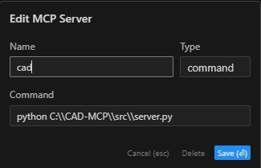

# CAD-MCP Server (CAD Model Context Protocol Server)

## 项目介绍

CAD-MCP是一个创新的CAD控制服务，允许通过自然语言指令控制CAD软件进行绘图操作。该项目结合了自然语言处理和CAD自动化技术，使用户能够通过简单的文本命令创建和修改CAD图纸，无需手动操作CAD界面。

## 功能特点

### CAD控制功能

- **多CAD软件支持**：支持AutoCAD、浩辰CAD(GCAD/GstarCAD)和中望CAD(ZWCAD)等主流CAD软件
- **基础绘图功能**：
  - 直线绘制
  - 圆形绘制
  - 圆弧绘制
  - 矩形绘制
  - 多段线绘制
  - 文本添加
  - 图案填充
  - 尺寸标注
- **图层管理**：创建和切换图层
- **图纸保存**：将当前绘图保存为DWG文件

### 自然语言处理功能

- **命令解析**：将自然语言指令解析为CAD操作参数
- **颜色识别**：从文本中提取颜色信息并应用到绘图对象
- **形状关键词映射**：支持多种形状描述词的识别
- **动作关键词映射**：识别各种绘图和编辑动作

## Demo

The following is the demo video.


## 安装要求

### 依赖项

```
pywin32>=228    # Windows COM接口支持
mcp>=0.1.0      # Model Control Protocol库
pydantic>=2.0.0 # 数据验证
typing>=3.7.4.3 # 类型注解支持
```

### 系统要求

- Windows操作系统
- 已安装的CAD软件（AutoCAD、浩辰CAD或中望CAD）

## 配置说明

配置文件位于`src/config.json`，包含以下主要设置：

```json
{
    "server": {
        "name": "CAD MCP 服务器",
        "version": "1.0.0"
    },
    "cad": {
        "type": "AutoCAD",  
        "startup_wait_time": 20,
        "command_delay": 0.5
    },
    "output": {
        "directory": "./output",
        "default_filename": "cad_drawing.dwg"
    }
}
```

- **server**: 服务器名称和版本信息
- **cad**: 
  - `type`: CAD软件类型（AutoCAD、GCAD、GstarCAD或ZWCAD）
  - `startup_wait_time`: CAD启动等待时间（秒）
  - `command_delay`: 命令执行延迟（秒）
- **output**: 输出文件设置

## 使用方法

### 启动服务

```
python src/server.py
```

### Claude Desktop 、 Windsurf

```bash
# add to claude_desktop_config.json. Note：use your path  
{
    "mcpServers": {
        "CAD": {
            "command": "python",
            "args": [
                # your path，e.g.："C:\\cad-mcp\\src\\server.py"
                "~/server.py"
            ]
        }
    }
}
```

### Cursor

```bash
# Add according to the following diagram Cursor MCP. Note：use your path  
```


说明：新版Cursor也改为了json配置，参见上一节

### MCP Inspector

```bash
# Note：use your path  
npx -y @modelcontextprotocol/inspector python C:\\cad-mcp\\src\\server.py
```

### 服务API

服务器提供以下主要API功能：

- `draw_line`: 绘制直线
- `draw_circle`: 绘制圆
- `draw_arc`: 绘制弧
- `draw_polyline`: 绘制多段线
- `draw_rectangle`: 绘制矩形
- `draw_text`: 添加文本
- `draw_hatch`: 绘制填充
- `add_dimension`: 添加线性标注
- `save_drawing`: 保存图纸
- `process_command`: 处理自然语言命令

## 项目结构

```
CAD-MCP/
├── imgs/                # 图像和视频资源
│   └── CAD-mcp.mp4     # 演示视频
├── requirements.txt     # 项目依赖
└── src/                 # 源代码
    ├── __init__.py     # 包初始化
    ├── cad_controller.py # CAD控制器
    ├── config.json     # 配置文件
    ├── nlp_processor.py # 自然语言处理器
    └── server.py       # 服务器实现
```

## 许可证

MIT License
