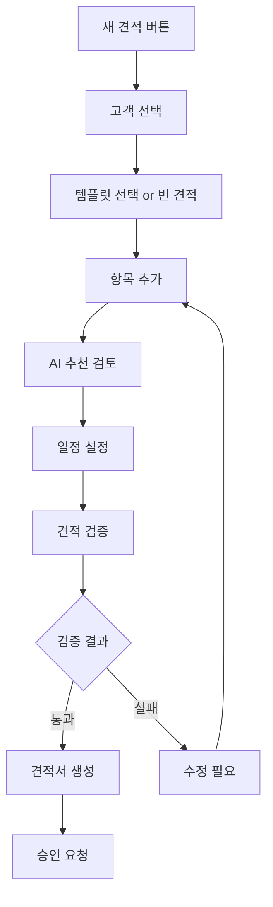

# 06_UI_Tabs.md

## UI 탭 구조 및 레이아웃 (UI Tabs Structure & Layout)

### 전체 레이아웃 구조 (Overall Layout Structure)

#### ChatGPT 스타일 사이드바 레이아웃 규칙

```css
/* 루트 Grid 레이아웃 */
.app-container {
  display: grid;
  grid-template-columns: 280px 1fr;
  grid-template-rows: 60px 1fr;
  grid-template-areas: 
    "sidebar header"
    "sidebar main";
  height: 100vh;
  overflow: hidden;
}

/* 사이드바 */
.sidebar {
  grid-area: sidebar;
  display: flex;
  flex-direction: column;
  min-height: 0; /* 중요: flex 아이템 축소 허용 */
  background: #f7f7f8;
  border-right: 1px solid #e5e5e7;
}

/* 메인 컨텐츠 영역 */
.main-content {
  grid-area: main;
  display: flex;
  flex-direction: column;
  min-height: 0; /* 중요: 내부 요소 overflow 처리 */
  overflow: hidden;
}

/* 내부 Flex Column 구조 */
.sidebar-content {
  display: flex;
  flex-direction: column;
  height: 100%;
  min-height: 0;
}

.sidebar-top {
  flex: 0 0 auto; /* 고정 높이 */
}

.sidebar-middle {
  flex: 1 1 auto; /* 가변 높이 */
  overflow-y: auto; /* 스크롤 허용 */
  min-height: 0;
}

.sidebar-bottom {
  flex: 0 0 auto; /* 고정 높이 */
  margin-top: auto; /* 하단 고정 */
}
```

### 탭 정의 및 플로우 (Tab Definitions & Flow)

## 1. 견적 탭 (Estimate Tab)

### 레이아웃 구조
```
┌─────────────────────────────────────────────────────────────┐
│                        Header Bar                          │
├─────────────────┬───────────────────────────────────────────┤
│   Sidebar       │              Main Content                │
│                 │                                           │
│ ┌─────────────┐ │ ┌─────────────────────────────────────────┐ │
│ │ 새 견적     │ │ │         Estimate Workspace          │ │
│ │ [+ 버튼]    │ │ │                                     │ │
│ └─────────────┘ │ │  ┌─────────────┐ ┌─────────────────┐ │ │
│                 │ │  │  Customer   │ │   Item List     │ │ │
│ ┌─────────────┐ │ │  │  Selection  │ │                 │ │ │
│ │ 최근 견적   │ │ │  └─────────────┘ └─────────────────┘ │ │
│ │ • EST-001   │ │ │                                     │ │
│ │ • EST-002   │ │ │  ┌─────────────┐ ┌─────────────────┐ │ │
│ │ • EST-003   │ │ │  │   AI        │ │    Timeline     │ │ │
│ └─────────────┘ │ │  │ Suggestions │ │                 │ │ │
│                 │ │  └─────────────┘ └─────────────────┘ │ │
│ ┌─────────────┐ │ │                                     │ │
│ │ 템플릿      │ │ │         Action Buttons              │ │
│ │ • 로봇설치  │ │ │  [저장] [검증] [견적서 생성]         │ │
│ │ • 자동화    │ │ │                                     │ │
│ └─────────────┘ │ └─────────────────────────────────────────┘ │
│                 │                                           │
│ ┌─────────────┐ │                                           │
│ │ 사용자 정보 │ │                                           │
│ │ 김견적      │ │                                           │
│ │ 견적 담당자 │ │                                           │
│ └─────────────┘ │                                           │
└─────────────────┴───────────────────────────────────────────┘
```

### 견적 탭 컴포넌트 구조

#### 사이드바 구성요소
```javascript
const EstimateSidebar = {
  top: {
    newEstimateButton: {
      label: "새 견적",
      icon: "plus",
      action: "createNewEstimate",
      style: "primary"
    }
  },
  middle: {
    recentEstimates: {
      title: "최근 견적",
      maxItems: 10,
      itemFormat: "EST-{number} - {customerName}",
      actions: ["open", "duplicate", "delete"]
    },
    templates: {
      title: "견적 템플릿",
      categories: ["산업 자동화", "로봇 설치", "소프트웨어", "서비스"],
      actions: ["apply", "edit", "create"]
    },
    drafts: {
      title: "임시 저장",
      autoSave: true,
      maxDrafts: 5
    }
  },
  bottom: {
    userInfo: {
      name: "current_user.name",
      role: "current_user.role",
      avatar: "current_user.avatar",
      actions: ["profile", "settings", "logout"]
    }
  }
};
```

#### 메인 워크스페이스
```javascript
const EstimateWorkspace = {
  header: {
    breadcrumb: ["견적", "새 견적 생성"],
    title: "견적 생성",
    actions: ["save", "saveTemplate", "preview"]
  },
  content: {
    sections: [
      {
        id: "customer",
        title: "고객 정보",
        component: "CustomerSelection",
        required: true
      },
      {
        id: "items",
        title: "견적 항목",
        component: "ItemList",
        required: true
      },
      {
        id: "ai-suggestions",
        title: "AI 추천",
        component: "AISuggestions",
        collapsible: true
      },
      {
        id: "timeline",
        title: "일정 계획",
        component: "Timeline",
        required: true
      }
    ]
  },
  footer: {
    actions: [
      { label: "임시 저장", type: "secondary", action: "saveDraft" },
      { label: "견적 검증", type: "secondary", action: "validate" },
      { label: "견적서 생성", type: "primary", action: "generate" }
    ]
  }
};
```

### 상호작용 플로우 (Interaction Flow)

#### 견적 생성 플로우


## 2. AI 매니저 탭 (AI Manager Tab)

### 레이아웃 구조
```
┌─────────────────────────────────────────────────────────────┐
│                     AI Manager Header                      │
├─────────────────┬───────────────────────────────────────────┤
│   Control       │              AI Dashboard                │
│   Panel         │                                           │
│                 │ ┌─────────────────────────────────────────┐ │
│ ┌─────────────┐ │ │         Model Performance           │ │
│ │ 활성 모델   │ │ │  Accuracy: 94.2%  Speed: 1.2s      │ │
│ │ v2.3.1      │ │ └─────────────────────────────────────────┘ │
│ │ [GPT-4o]    │ │                                           │
│ └─────────────┘ │ ┌─────────────┐ ┌─────────────────────┐ │ │
│                 │ │   Training  │ │    Prediction       │ │ │
│ ┌─────────────┐ │ │   Status    │ │    Queue            │ │ │
│ │ 학습 데이터 │ │ │             │ │                     │ │ │
│ │ 1,247건     │ │ │ In Progress │ │ 15 pending requests │ │ │
│ │ [업데이트]  │ │ │ 67% complete│ │                     │ │ │
│ └─────────────┘ │ └─────────────┘ └─────────────────────┘ │ │
│                 │                                           │
│ ┌─────────────┐ │ ┌─────────────────────────────────────────┐ │
│ │ 모델 설정   │ │ │         Feedback & Learning         │ │
│ │ • 정확도    │ │ │                                     │ │ │
│ │ • 속도      │ │ │  Recent Feedback: 87% positive     │ │ │
│ │ • 임계값    │ │ │  Model Updates: 3 pending          │ │ │
│ └─────────────┘ │ └─────────────────────────────────────────┘ │
│                 │                                           │
│ ┌─────────────┐ │                                           │
│ │ 시스템 상태 │ │                                           │
│ │ 🟢 정상     │ │                                           │
│ └─────────────┘ │                                           │
└─────────────────┴───────────────────────────────────────────┘
```

### AI 매니저 탭 기능

#### 모델 관리
- **활성 모델 표시**: 현재 사용 중인 AI 모델명과 버전
- **성능 메트릭**: 정확도, 응답 시간, 처리량
- **모델 전환**: 다른 모델로 전환 (A/B 테스트)
- **하이퍼파라미터 조정**: 학습률, 배치 크기 등

#### 학습 데이터 관리
- **데이터셋 현황**: 학습 데이터 건수, 품질 지표
- **데이터 업데이트**: 새로운 견적 데이터 추가
- **데이터 정제**: 이상치 제거, 라벨링 검증
- **데이터 분포**: 카테고리별, 시기별 분포 차트

#### 예측 모니터링
- **실시간 큐**: 처리 대기 중인 예측 요청
- **성공률 추적**: 예측 성공/실패 비율
- **응답 시간**: 평균, 최대, 95퍼센타일 응답 시간
- **에러 로그**: 실패한 예측 요청 상세 정보

## 3. 카탈로그 탭 (Catalog Tab)

### 레이아웃 구조
```
┌─────────────────────────────────────────────────────────────┐
│                    Catalog Browser                         │
├─────────────────┬───────────────────────────────────────────┤
│   Category      │           Product Grid                   │
│   Tree          │                                           │
│                 │ ┌───────┐ ┌───────┐ ┌───────┐ ┌───────┐ │
│ ┌─────────────┐ │ │ 로봇  │ │ 센서  │ │ PLC   │ │ 케이블│ │
│ │ + 하드웨어  │ │ │ ARM-1 │ │ PROX-2│ │ S7-300│ │ 50M   │ │
│ │   - 로봇    │ │ │ ¥2.5M │ │ ¥150K │ │ ¥800K │ │ ¥50K  │ │
│ │   - 센서    │ │ └───────┘ └───────┘ └───────┘ └───────┘ │
│ │   - PLC     │ │                                           │
│ └─────────────┘ │ ┌───────┐ ┌───────┐ ┌───────┐ ┌───────┐ │
│                 │ │ HMI   │ │ 드라이버│ │ 설치  │ │ 교육  │ │
│ ┌─────────────┐ │ │ TP700 │ │ VFD-5 │ │ 서비스│ │ 과정  │ │
│ │ + 소프트웨어│ │ │ ¥300K │ │ ¥450K │ │ ¥200K │ │ ¥100K │ │
│ │   - 제어SW  │ │ └───────┘ └───────┘ └───────┘ └───────┘ │
│ │   - 분석SW  │ │                                           │
│ └─────────────┘ │ [검색: "로봇"]  [필터] [정렬: 가격순]     │
│                 │                                           │
│ ┌─────────────┐ │ ┌─────────────────────────────────────────┐ │
│ │ + 서비스    │ │ │          Quick Actions                │ │
│ │   - 설치    │ │ │ [카탈로그 추가] [일괄 가격 업데이트]    │ │
│ │   - 교육    │ │ │ [재고 확인] [공급업체 연락]           │ │
│ │   - 유지보수│ │ └─────────────────────────────────────────┘ │
│ └─────────────┘ │                                           │
└─────────────────┴───────────────────────────────────────────┘
```

### 카탈로그 기능

#### 제품 브라우징
- **카테고리 트리**: 계층적 제품 분류
- **그리드/리스트 뷰**: 제품 목록 표시 형식 선택
- **검색 및 필터**: 키워드, 가격대, 브랜드별 필터링
- **정렬 옵션**: 가격, 인기도, 최신순 정렬

#### 제품 상세 정보
- **기술 사양**: 상세 제품 스펙
- **가격 정보**: 단가, 할인율, 수량별 가격
- **재고 상태**: 실시간 재고 수량
- **공급업체 정보**: 연락처, 납기일

#### 관리 기능
- **카탈로그 업데이트**: 새 제품 추가, 기존 제품 수정
- **가격 관리**: 일괄 가격 업데이트, 할인 정책
- **재고 관리**: 재고 추적, 부족 알림
- **공급업체 관리**: 공급업체 정보, 계약 조건

## 4. 설정 탭 (Settings Tab)

### 레이아웃 구조
```
┌─────────────────────────────────────────────────────────────┐
│                      Settings                              │
├─────────────────┬───────────────────────────────────────────┤
│   Settings      │           Configuration Panel           │
│   Menu          │                                           │
│                 │ ┌─────────────────────────────────────────┐ │
│ ┌─────────────┐ │ │            User Profile             │ │
│ │ • 사용자    │ │ │                                     │ │ │
│ │ • 시스템    │ │ │  Name: [김견적]    Role: [매니저]     │ │ │
│ │ • 보안      │ │ │  Email: [kim@company.com]           │ │ │
│ │ • 통합      │ │ │  Phone: [010-1234-5678]             │ │ │
│ │ • 백업      │ │ │                                     │ │ │
│ └─────────────┘ │ │  [프로필 수정] [비밀번호 변경]        │ │ │
│                 │ └─────────────────────────────────────────┘ │
│ ┌─────────────┐ │                                           │
│ │ • API 설정  │ │ ┌─────────────────────────────────────────┐ │
│ │ • 알림      │ │ │           System Settings           │ │
│ │ • 테마      │ │ │                                     │ │ │
│ │ • 언어      │ │ │  Language: [한국어 ▼]               │ │ │
│ │ • 접근성    │ │ │  Timezone: [Asia/Seoul ▼]           │ │ │
│ └─────────────┘ │ │  Theme: [라이트 ○ 다크 ○ 자동 ●]    │ │ │
│                 │ │  Currency: [KRW ▼]                  │ │ │
│ ┌─────────────┐ │ │                                     │ │ │
│ │ • 감사로그  │ │ │  [설정 저장] [기본값 복원]            │ │ │
│ │ • 성능      │ │ └─────────────────────────────────────────┘ │
│ │ • 라이센스  │ │                                           │
│ └─────────────┘ │                                           │
└─────────────────┴───────────────────────────────────────────┘
```

### 설정 카테고리

#### 사용자 설정
- **개인 정보**: 이름, 이메일, 전화번호
- **선호 설정**: 언어, 시간대, 통화 단위
- **알림 설정**: 이메일, SMS, 푸시 알림 설정
- **접근성 설정**: 글꼴 크기, 고대비 모드, 키보드 네비게이션

#### 시스템 설정
- **업무 설정**: 기본 견적 유효기간, 승인 워크플로우
- **성능 설정**: 캐시 크기, 동시 처리 수, 응답 시간 제한
- **보안 설정**: 세션 타임아웃, MFA 설정, 패스워드 정책
- **백업 설정**: 자동 백업 주기, 보관 기간, 복구 설정

#### 통합 설정
- **ERP 연동**: SAP, Oracle, MS Dynamics 연결 설정
- **API 키 관리**: 외부 서비스 API 키 관리
- **웹훅 설정**: 이벤트 알림 웹훅 구성
- **데이터 동기화**: 동기화 주기, 충돌 해결 정책

## 반응형 디자인 (Responsive Design)

### 브레이크포인트
```css
/* Desktop First 접근 */
@media (max-width: 1200px) {
  .app-container {
    grid-template-columns: 240px 1fr;
  }
}

@media (max-width: 768px) {
  .app-container {
    grid-template-columns: 1fr;
    grid-template-areas: 
      "header"
      "main";
  }
  
  .sidebar {
    position: fixed;
    top: 60px;
    left: -280px;
    width: 280px;
    height: calc(100vh - 60px);
    transition: left 0.3s ease;
    z-index: 1000;
  }
  
  .sidebar.open {
    left: 0;
  }
}

@media (max-width: 480px) {
  .sidebar {
    width: 100vw;
    left: -100vw;
  }
}
```

### 모바일 최적화
- **터치 친화적**: 최소 44px 터치 타겟
- **스와이프 네비게이션**: 좌우 스와이프로 탭 전환
- **축약된 UI**: 중요 정보만 표시
- **오프라인 지원**: 기본 기능 오프라인 사용 가능

---
*문서 버전: 1.0*  
*최종 수정: 2025-09-22*  
*승인자: 이충원 (대표이사)*